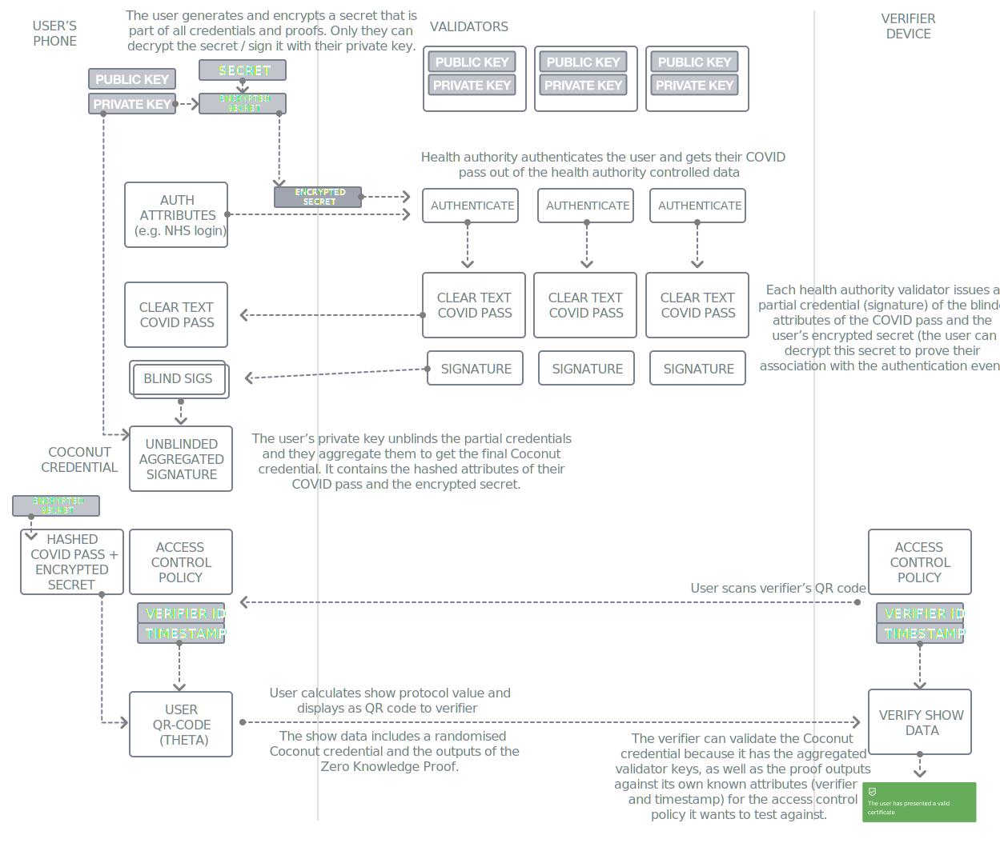

# Private COVID Certificate (PCC) - A Coconut Prototype

The existing Digital Covid Certificates do not provide strong privacy properties, it can expose a lot of information about an individual, and can further be used to create a map of the places the person has visited and therefore be used as a tracking system.

We propose a privacy enhanced version using blinded and re-randomizable Coconut credentials that can tackle the above issues. We call this product Private Covid Certificate (PCC)

## Technology

Privacy is provided by [Nym's Coconut technology](https://github.com/nymtech/coconut), both for identity and private versions of documents that contain large amounts of personal data, e.g. COVID passes and test results.

The mobile app prototype has been developed as a [Progressive Web App (PWA)](https://web.dev/progressive-web-apps/) using [React](https://reactjs.org/) to avoid the need to deploy it via the Google Play or Apple App Stores. This saves on the long review cycles, deployment complexity and makes it easy to try out without installing an app.

In the future, the prototype app can be adapted to use [React Native](https://reactnative.dev/) so that it can be built into a native app and release via the normal app stores for Android and iOS.

The mobile app uses the following key libraries:

- [React](https://reactjs.org/), 
  [Webpack](https://webpack.js.org/), 
  [Babel](https://babeljs.io/),
  [Typescript](https://www.typescriptlang.org/) and 
  [React Material UI](https://material-ui.com/).
- [HTML5 Audio and Video capture](https://www.html5rocks.com/en/tutorials/getusermedia/intro/) for device camera access.
- Health certificate decoding libraries and forks from European Union's Digital Green Certificate efforts via the [European eHealth network](https://github.com/ehn-dcc-development).

The Coconut code is packaged as a WASM package using [`wasm-pack`](https://github.com/rustwasm/wasm-pack).

Coconut credentials are issued and verified as follows:



## Getting Started

Developers will need to do the following to get their environment set up:

1. Install NodeJS using Node Version Manager (`nvm`) by following these instructions: https://github.com/nvm-sh/nvm#installing-and-updating

2. `nvm install`

The correct version of NodeJS will be installed.

3. `npm install`

## Build Coconut WASM

Make sure you have Rust and `wasm-pack` installed by following the instructions at:
- https://rustup.rs/
- https://rustwasm.github.io/wasm-pack/installer/

```
cd packages/coconut-wasm
wasm-pack build
```

## Mobile App

Run the apps in dev mode:

```
cd packages/ledger-mobile-app
npm install
npm run start
```

Go to https://localhost:3000/

> **Note:** the local dev server runs on HTTPS because this is the only way the camera video stream is allowed to be consumed by the browser's script

## Coconut CLI and WASM playground

A CLI for experimenting with Coconut can be found in [packages/coconut-cli](packages/coconut-cli) with a similar tool that runs the Coconut WASM package in the browser ([packages/coconut-wasm/www](packages/coconut-wasm/www)).
